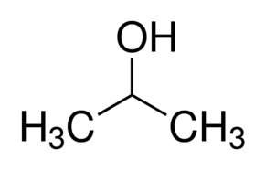
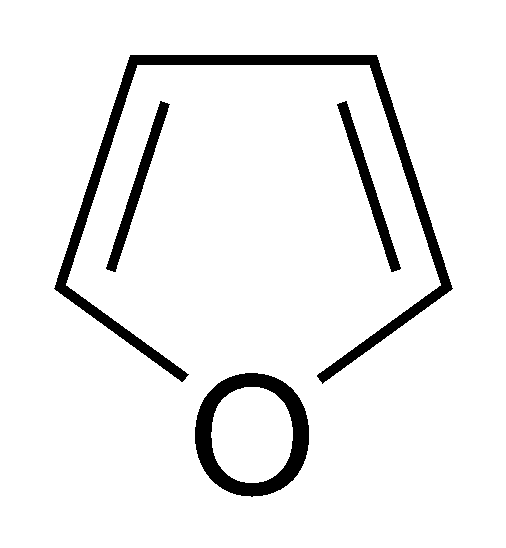
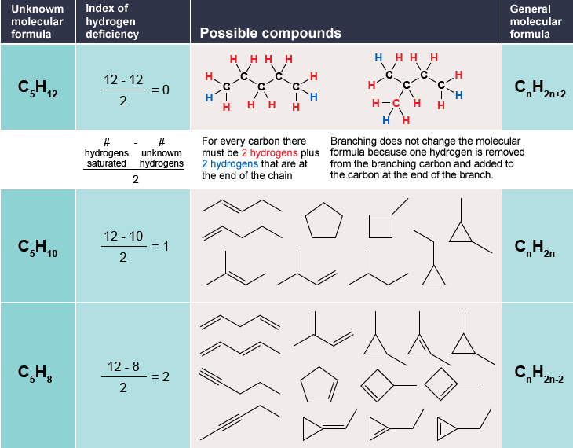

# hdiplus
A simple program for calculating the Hydrogen Deficiency Index of a molecule. The program also returns potential structural features of the molecule.

The calculator assumes the molecule is uncharged and each atom within the molecule exhibits standard valency within the molecular structure.
### Background 
A molecule's hydrogen deficiency index, or HDI, is a measure of the number of rings and π bonds within the molecule's structure. Each organic molecule (with standard valency and charge properties) has a non-negative integer valued HDI.  

The HDI of a molecule, also known as the molecule's degree of unsaturation, is straightforward to observe from the molecule's structure. Each ring adds one to the total HDI of the molecule, as does each double bond. For the purposes of HDI calculation, a triple bond is equivalent to two double bonds. For example, isopropanol (rubbing alcohol) has no double bonds or rings in its structure, giving it an HDI of zero.

However, furan has a ring and two double bonds in its structure, giving it an HDI of three.

A formula for HDI also exists, based on the number of carbons, nitrogens, hydrogens, and halogens in the molecule:

### Motivation
Calculating a molecule's HDI is a necessary step in the determination of structural features of organic (and certain inorganic) molecules. The degree of unsaturation of a molecule acts as a very strong constraint on the possible number of structures the molecule can theoretically observe, as displayed in the following table.

The possible number of structures a given molecular formula can take is then further constrained by various spectroscopic methods (including possibly NMR, IR, and UV-Vis spectroscopy, as well as many other possibilities depending on the type of molecule being analyzed) to give the final structure of the molecule.

Since HDI determination is such a crucial step in figuring out molecular structures, I wanted to create a program that could not only calculate the HDI of a given molecule based on its molecular formula, but also use chemical principles and logic to provide potential structural features of that molecule in order to expedite the structural discovery process.
### Functionality
The calculator currently supports HDI calculation for standard organic molecules containing carbon, hydrogen, oxygen, nitrogen, and halogens. The calculator also provides the HDI for certain nitrogenous inorganic molecules, such as hydrazine. The calculator does not support HDI calculations of multivalent halogens, such as interhalogen compounds.

In addition, the calculator returns standard functional group moieties that may be present in the molecule, as well as additional information such as potential aromaticity of the molecule and relevant spectroscopic methods that may prove useful for the provided molecule. The calculator does this based on various principles that dictate the presence of different functional groups in molecules by inputting the molecule's formula into a series of conditional statements that align with the aforementioned chemical principles and rules. 
### Future Vision
Future steps for the calculator include incorporating higher period elements exhibiting standard valency properties in HDI calculation (e.g. calculating the HDI of pnictogen hydrides, or organic chalcogen/boron group molecules), and refining the potential functional groups the calculator returns after the HDI is calculated. A website is also currently being set up for ease of access to the hdiplus smart calculator system.
